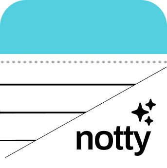
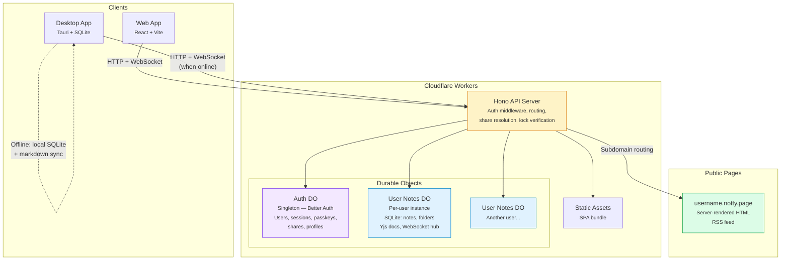
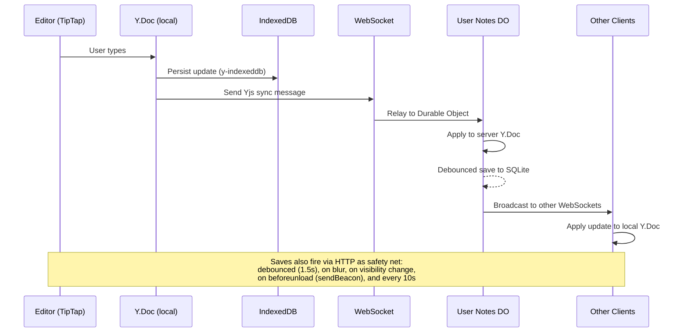
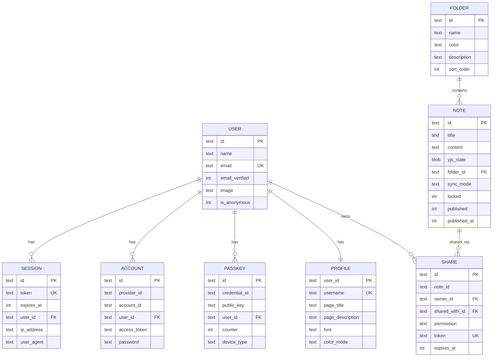

<p align="center">
  
</p>

<h1 align="center">Notty</h1>

<p align="center">
  <strong>A fast, minimal notes app that syncs everywhere.</strong><br/>
  Rich editing. Real-time collaboration. Offline-first. Your data stays yours.
</p>

<p align="center">
  <a href="https://notty.dhr.wtf">Web App</a> &middot;
  <a href="#desktop-app">Desktop App</a> &middot;
  <a href="#public-pages">Public Pages</a>
</p>

---

## Features

**Editor** — Built on [Novel](https://novel.sh) (TipTap/ProseMirror). Slash commands, bubble toolbar, markdown shortcuts, drag handles, and block-level editing. Headings, lists, task lists, blockquotes, code blocks, links, horizontal rules. Three font choices (sans, serif, mono) and optional ruled-paper lines. No bloat.

**Real-time sync** — Every note is a [Yjs](https://yjs.dev) CRDT document. Edits sync over WebSocket in real time between all your devices and collaborators. No save button. No conflicts. Changes merge automatically.

**Offline-first** — Notes persist to IndexedDB locally. Open the app on a plane, keep writing, and everything syncs when you're back online. Edits queue up and flush on reconnect.

**Desktop app** — Native macOS app via [Tauri](https://tauri.app). Local SQLite database, bidirectional markdown sync to `~/Documents/Notty/`, and cloud sync when available. Works fully offline.

**Collaboration** — Share notes by email or link with view/edit permissions. Real-time cursors show who's editing where. Collaborators see each other's presence with colored avatars.

**Note locking** — Lock sensitive notes behind passkey (WebAuthn) verification. Locked notes require biometric/PIN authentication to view or edit — even for shared collaborators.

**Publishing** — Publish any note to your personal subdomain at `username.notty.page`. Server-rendered HTML, no JavaScript required for readers. Customizable font, color mode, title, and description.

**RSS** — Every public page has an RSS feed at `username.notty.page/rss`. Standard RSS 2.0 with Atom self-link.

**Folders** — Color-coded folders with descriptions. Drag notes between folders. Inline rename and delete. Note counts per folder.

**Command palette** — `Cmd+K` opens a searchable palette with actions, folder navigation, and fuzzy note search. Keyboard-driven workflow throughout.

**Dark mode** — System-aware dark mode with manual toggle. Warm, paper-like color palette in both modes.

**Keyboard shortcuts** — Vim-inspired navigation (`j`/`k`), quick actions (`n` for new note, `x` to delete, `v` to toggle view), and editor formatting (`Cmd+B/I/U`). Press `?` to see them all.

---

## Architecture

Notty runs on Cloudflare Workers with Durable Objects for storage. Each user gets their own isolated Durable Object with an embedded SQLite database — no shared database, no cross-tenant queries, complete data isolation by design.



### Data flow: editing a note



### Data model



> The Auth DO (singleton) stores users, sessions, accounts, passkeys, shares, and profiles. Each User Notes DO (per-user) stores that user's notes and folders. There is no shared database — data isolation is structural.

---

## Auth

Authentication is handled by [Better Auth](https://www.better-auth.com) with the following methods:

| Method | Details |
|--------|---------|
| **Passkeys** | WebAuthn/FIDO2 — biometric or hardware key. Primary auth method. |
| **Google** | OAuth 2.0 |
| **GitHub** | OAuth 2.0 |
| **Apple** | Sign in with Apple (JWT client secret generation) |
| **Anonymous** | Start writing immediately, link a real account later |

Passkeys are also used for note locking — a locked note requires re-authentication via WebAuthn challenge before content is revealed. Lock tokens are short-lived (5 minutes) and scoped to a specific note + user.

---

## Desktop App

The Tauri desktop app provides:

- **Local SQLite** — All notes and folders stored in `~/Library/Application Support/notty/notty.db`
- **Markdown sync** — Bidirectional sync to `~/Documents/Notty/`, organized by folder. Notes export as `.md` files with TipTap JSON-to-markdown conversion, and external markdown files can be imported back
- **Cloud sync** — When a cloud URL is configured, the desktop app merges local and cloud state bidirectionally (local-first, prefer newer timestamps)
- **Deep link auth** — `notty://auth?token=...` deep links for seamless sign-in from browser to desktop
- **Offline-first** — Everything works without internet. Cloud features activate when connectivity is available

---

## Public Pages

Any authenticated user can claim a username and publish notes to `username.notty.page`:

- **Server-rendered** — Pure HTML + CSS, zero JavaScript sent to readers
- **Customizable** — Choose font (sans/serif/mono), color mode (light/dark), page title, and description
- **Individual note pages** — Each published note gets a permalink at `username.notty.page/:noteId`
- **RSS feed** — Auto-generated at `username.notty.page/rss`, standard RSS 2.0 with Atom self-link
- **TipTap-to-HTML** — Full server-side rendering of the editor's JSON format including headings, lists, task lists, code blocks, blockquotes, links, and images

---

## Keyboard Shortcuts

### Global

| Key | Action |
|-----|--------|
| `Cmd+K` | Command palette |
| `Cmd+D` | Toggle dark mode |
| `Cmd+\` | Toggle sidebar |
| `?` | Show all shortcuts |

### Note List

| Key | Action |
|-----|--------|
| `N` | New note |
| `J` / `K` | Navigate up/down |
| `Enter` | Open selected note |
| `X` | Delete selected note |
| `V` | Toggle grid/timeline view |
| `S` | Cycle sort mode |
| `/` | Focus search |

### Editor

| Key | Action |
|-----|--------|
| `/` | Slash commands |
| `Cmd+B` | Bold |
| `Cmd+I` | Italic |
| `Cmd+U` | Underline |
| `Cmd+Shift+X` | Strikethrough |
| `Cmd+E` | Inline code |
| `Esc` | Back to notes |

---

## Tech Stack

| Layer | Technology |
|-------|-----------|
| **Frontend** | React 19, Vite 8, Tailwind CSS 4 |
| **Editor** | Novel (TipTap/ProseMirror), Yjs CRDTs |
| **Server** | Hono on Cloudflare Workers |
| **Storage** | Durable Objects with embedded SQLite |
| **Auth** | Better Auth (passkeys, OAuth, anonymous) |
| **Realtime** | Yjs sync protocol over WebSocket via Durable Objects |
| **Offline** | IndexedDB (y-indexeddb), queued updates |
| **Desktop** | Tauri 2 (Rust), rusqlite, markdown sync |
| **Deployment** | Cloudflare Workers + Wrangler |
| **Domains** | `notty.dhr.wtf`, `notty.page`, `*.notty.page` |

---

## Development

```bash
# Install dependencies
bun install

# Run locally (Cloudflare Workers dev server)
bun dev

# Build for production
bun run build

# Deploy to Cloudflare
bun run deploy

# Desktop app (requires Rust toolchain)
bun run tauri:dev
bun run tauri:build
```

Environment variables are managed with [dotenvx](https://dotenvx.com) (encrypted `.env`). Required:

```
BETTER_AUTH_SECRET
BETTER_AUTH_URL
GOOGLE_CLIENT_ID / GOOGLE_CLIENT_SECRET
GITHUB_CLIENT_ID / GITHUB_CLIENT_SECRET
APPLE_CLIENT_ID / APPLE_PRIVATE_KEY / APPLE_TEAM_ID / APPLE_KEY_ID
```

---

## License

All rights reserved.
